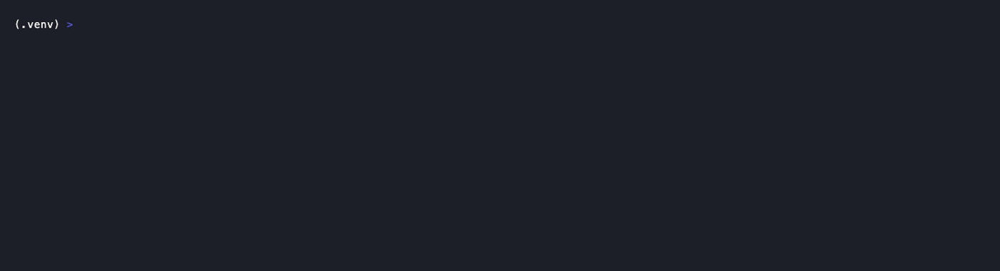
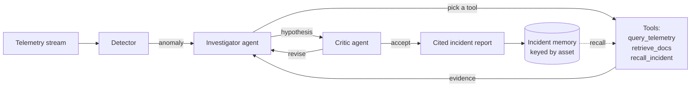

# Grid Copilot

Anomaly detection plus agentic root-cause analysis on industrial/grid telemetry.
It ingests operational-technology (OT) time-series, detects an anomaly, then lets
an agent investigate it, gathering evidence from the telemetry window, from
equipment and protocol documentation, and from memory of prior incidents on the
same asset, and produces a root-cause report where every claim is cited.

Everything here runs on **public and synthetic data**, by design. It is a
rebuild, on inspectable data, of the kind of anomaly-detection and root-cause
work that is otherwise stuck behind a confidentiality clause. Nothing in this
repository is derived from any employer's data or code.

## Demo

A live run on Groq's `gpt-oss-120b`: the detector flags a bearing-temperature
anomaly on `turbine_1`, and the agent investigates it, writing its own tool
queries as it calls `query_telemetry`, `retrieve_docs`, and `recall_incident`,
then concludes an incipient bearing fault that matches the injected ground truth,
with every step streamed.



```bash
python -m grid_copilot.cli            # live by default (needs GROQ_API_KEY); --provider mock to run offline
```

## Dashboard

A React dashboard (`web/`) over a FastAPI backend that runs the real pipeline and
streams the actual investigation events over SSE: live telemetry with the anomaly
highlighted, the agent's step-by-step reasoning, the cited incident report, and
the HAI detector benchmark. Setup and details in [web/README.md](web/README.md).


```bash
pip install -e ".[web]" && uvicorn grid_copilot.server:app --port 8000   # backend
cd web && npm install && npm run dev                                     # frontend
```

## The loop



The detector is a fixed-baseline z-score with a persistence guard (below). The
agent runs a bounded investigation: each round it either calls one tool to
gather more evidence or concludes with a root cause, then a critic accepts the
hypothesis or asks for a revision. Every step emits an event, so the reasoning is
observable as it happens, not just at the end.

## Built on three repos

The point of the design is that it is not one weekend project, it is three pieces
of infrastructure wired into one system:

- **[Cortex](../cortex)** supplies the orchestration primitives: the
  provider-agnostic `LLMClient` layer (mock, Anthropic, Groq), the `Agent` base
  with tolerant JSON parsing, and the `EventBus` that makes the run observable.
  The investigation loop here is the domain equivalent of Cortex's
  perceive-plan-execute-critique orchestrator, retargeted to root-cause analysis.
- **[Mnemos](../mnemos)** supplies per-asset incident memory. The mapping is the
  trick: an asset id becomes a Mnemos `user_id`, so "what has gone wrong on
  `turbine_1` before" is literally `recall(user_id="turbine_1", ...)`. It sits
  behind an `IncidentStore` interface with a zero-dependency local store, so the
  offline demo needs no database.
- **Grid Copilot** (this repo) is the domain system: ingest, detector, tools,
  the investigation loop, the eval harness.

## Run it

Live by default: it runs on a hosted model, with the key in a local `.env`
(gitignored). No dataset download, no database.

```bash
python -m venv .venv && source .venv/bin/activate
pip install ../cortex           # Cortex has no dependencies of its own
pip install -e ".[groq]"        # or ".[live]" for Anthropic
echo "GROQ_API_KEY=..." > .env   # or ANTHROPIC_API_KEY=...
python -m grid_copilot.cli       # add --provider mock for a keyless offline run
```

Sample live run (a bearing overheating on `turbine_1`, injected into
otherwise-nominal data), the agent writing its own tool queries:

```
 [!] bearing_temp_c on turbine_1 (score 5.68)
 [>>] query_telemetry('') — to see how bearing_temp_c and other signals behaved
   -> bearing_temp_c rose +10.38 (65.1->75.5); vibration_mm_s rose +2.18 (2.5->4.6).
      Stable: rotor_speed_rpm, output_mw. Onset: bearing_temp_c at +197, vibration at +204.
 [>>] retrieve_docs('bearing temperature vibration turbine fault') — link the co-rise to a signature
   -> Closest reference 'Bearing thermal-fault signature': a degrading bearing shows a
      slow rise in temperature that tracks together with rising vibration.
 [>>] recall_incident('turbine_1 bearing temperature vibration spike') — has this happened before?
   -> No prior incidents recorded for turbine_1.
 [=] Degrading rolling-element bearing causing thermal fault
 [?] accept
 [done] INC-0001: turbine_1: Degrading rolling-element bearing causing thermal fault
```

The report that follows cites the document it relied on, and because the demo
data is labeled, the last line confirms the conclusion against the injected
ground truth. No key handy? `--provider mock` runs the whole loop offline on a
deterministic mock brain, no key, no download, no database.

Live Groq runs are unscripted: on a real HAI boiler anomaly (with
`--retriever vector`), it correctly reads a coordinated drop in a
pressure-control-valve's command and position as a valve/control fault that moved
the boiler pressure transmitter, rather than a generic guess (see the writeup for
how the first version got this wrong and what fixed it).

To persist incidents across runs with Mnemos (embedded, no server), add
`--memory mnemos`: investigate the same asset twice and the second run recalls
the first from memory.

## Evaluation

The differentiator is that root-cause quality is measured, not asserted. The
harness injects each known fault into nominal telemetry, runs the full pipeline,
and scores detection, cost, and the stated cause with two graders side by side: a
cheap keyword match and an LLM-as-judge (`--judge` picks its provider).

```bash
python -m eval.harness --provider groq --judge groq   # real agent, real judge
```

```
fault             detected  latency  rounds  keyword  judge          hypothesis
----------------------------------------------------------------------------------
bearing_overheat  yes       +33      3       hit      0.20 incorrect sustained deviation...
freq_excursion    yes       +29      3       hit      0.20 incorrect (mock agent, groq judge)
```

The contrast is the point: keyword matching marks every scenario "hit", but the
judge catches that a "sustained deviation in frequency" answer names the *signal*,
not the *mechanism* (a load-generation imbalance), and scores it low. The strong
live agent's answers, which do identify the mechanism, the judge scores as
correct. `latency` is samples after onset; `rounds` proxies token/latency cost.
The harness already paid for itself twice over: it caught a detector ranking bug
(the agent blaming a phase-angle sensor), and the judge caught keyword matching
over-crediting signal-only answers.

### On real data (HAI)

The same pipeline runs against the real HAI dataset, scored against its own
per-process attack labels:

```bash
# one-time download (test ~6 MB, train ~29 MB, official repo)
curl -L -o data/test1.csv.gz  https://raw.githubusercontent.com/icsdataset/hai/master/hai-21.03/test1.csv.gz
curl -L -o data/train1.csv.gz https://raw.githubusercontent.com/icsdataset/hai/master/hai-21.03/train1.csv.gz
python -m eval.hai_eval --train data/train1.csv.gz    # compare detectors
```

The eval reports point-adjusted precision/recall/F1 (the SWaT/WADI/HAI standard),
fitting "normal" on the attack-free train file and detecting on test (5 labeled
attacks):

| detector         | precision | recall | F1 (point-adjusted) | F1 (strict, per-timestep) |
|------------------|-----------|--------|----------------------|----------------------------|
| z-score baseline | 39%       | 100%   | 0.57                 | 0.26                       |
| autoencoder      | 54%       | 100%   | 0.70                 | 0.58                       |

The first pass (univariate z-score, normal fit on a short test prefix, event
scoring) caught every attack but only ~13% of its alarms were real: a single
fixed-baseline detector over-alarms on multi-modal ICS data. A small per-asset
**autoencoder** (`grid_copilot/detect/autoencoder.py`, `pip install -e ".[detect]"`)
that learns cross-signal correlations, plus the correct train-on-normal
protocol, catches all five attacks at meaningfully higher precision.

The eval also prints a stricter, un-adjusted per-timestep F1 so the
point-adjusted headline is not oversold, and tuning specifically for that
stricter metric surfaced a real, honest trade-off rather than a free win: the
autoencoder originally reported 90% precision / F1(adj) 0.95, but its
per-timestep F1 was a weak 0.24, because its `persistence` guard (5
*consecutive* above-threshold samples required before firing) only reports the
single sample that crosses the line, silently dropping most of an attack's
true positives under the strict metric. Relaxing `persistence` to 1 for
evaluation (`eval/hai_eval.py::build_detector`, agent-facing use keeps the
default) raised per-timestep F1 to 0.58, a real improvement, paid for with
lower point-adjusted precision (90% -> 54%) since more borderline samples now
fire. The same change was tried on the z-score baseline too and *reverted*: it
made z-score's strict F1 worse (0.26 -> 0.13), since z-score's own docstring
notes persistence exists specifically to suppress single-sample noise blips,
which the univariate detector needs far more than the autoencoder does. Only
the autoencoder's eval configuration changed; the numbers above reflect what
was actually measured, not what would look best.

**`--pr-curve` sweeps the threshold instead of reporting one point.** The 54%
precision / 47%-at-strict number above is one operating point (raw reconstruction
error over threshold >= 1.0). `python -m eval.hai_eval --train data/train1.csv.gz
--pr-curve` scores every reading with the detector's ungated `raw_score()` across
a range of threshold multipliers and reports precision/recall/F1 at each, plus
AUC-PR: at k=1.5 precision rises to 64% (recall 73%, F1 0.68), and at k=2.0 to
87% (recall 66%, F1 0.75; AUC-PR 0.08 overall). Which point to run at is a
product decision (tolerable false-alarm rate per caught attack), which is why the
eval reports the curve rather than picking a single headline number.

**`--all-tests --limit 0` runs the same protocol against all five real HAI test
files, not just test1's five attacks.** HAI's `hai-21.03` release ships test1
through test5; pooling counts (not averaging each file's F1) across all five
uncapped files, 402,005 timesteps and 118 labeled attack-process intervals
total:

| detector          | recall | caught  |
|-------------------|--------|---------|
| z-score baseline  | 90%    | 108/118 |
| autoencoder       | 87%    | 97/118  |
| ensemble(z&ae)     | 87%    | 97/118  |

Recall holds up well across the larger, more diverse attack set (87-90%, vs
100% on test1 alone). Both detectors are fit on only `train1`'s 25,000
attack-free steps, one recording session; test2-test5 are separate sessions,
so a broader, multi-session training set is the natural next step for
tightening detection further. Full breakdown: [docs/eval-writeup.md](docs/eval-writeup.md).

Add `--judge groq` to also grade the live agent's real-data root cause against a
reference derived from the labels (affected process plus the signals that
deviated). That grading drove a sequence of real fixes, each raising the score:
widening the investigation window past the detection snapshot (0.2), reporting
signal onset order so the agent reasons about causal direction rather than
guessing it (0.3), and always including the detector's trigger signal (0.6). The
last step also exposed an honest limit: onset-based causal direction is sensitive
to a small, noisy trigger signal, so the true direction is not always settleable
from telemetry alone. Full analysis and all the agent failure modes:
[docs/eval-writeup.md](docs/eval-writeup.md).

## Observability

LLM calls and the investigation's tool-call lifecycle can be traced with
[Langfuse](https://langfuse.com), self-hosted (not Langfuse Cloud). It is
opt-in and env-var gated: with `LANGFUSE_PUBLIC_KEY`/`LANGFUSE_SECRET_KEY`
unset, `grid_copilot/observability.py` builds a `NullTracer` and never
imports the `langfuse` package, so nothing changes for the offline path.

```bash
pip install -e ".[observability]"
export LANGFUSE_PUBLIC_KEY=pk-lf-grid-copilot-demo
export LANGFUSE_SECRET_KEY=sk-lf-grid-copilot-demo
export LANGFUSE_HOST=http://localhost:3000   # the self-hosted instance from docker-compose.yml
python -m grid_copilot.cli --provider mock
```

Each `investigate()` call becomes one trace (a `LangfuseObservedClient`
decorates the LLM client to record one generation per call; a
`LangfuseEventListener` turns the existing `RCAEvent` lifecycle into nested
spans), and `eval/harness.py` groups a batch of scenarios into one session per
run via `observed_session(...)`. This is Langfuse's session-plus-tag
grouping, not its separate Datasets/Experiments API.

**Verified end to end** against a real, running self-hosted Langfuse
instance (via `docker compose up`, see below): triggering an investigation
produced a real trace with 10 nested observations and the correct final
output, queryable through Langfuse's own API. That run caught a real bug:
the real Langfuse SDK's top-level trace object has no `.end()` (only spans
and generations do; a trace closes implicitly), which the offline fake-tracer
tests did not catch since the fake was too permissive. Fixed by calling
`.update()` on the trace instead, and the fake tracer in
`tests/test_observability.py` was tightened to only expose `.end()` on span
objects, matching the real SDK's shape.

## Running with Docker

`Dockerfile` builds the API image. Because Cortex is an unpublished sibling
repo, not a PyPI package, it is pulled in as a separate named build context
rather than folding the whole parent directory into the build (which would
tar up every unrelated sibling repo alongside grid-copilot):

```bash
docker buildx build -f Dockerfile --build-context cortexsrc=../cortex -t grid-copilot:latest .
```

`docker-compose.yml` runs the API alongside a self-hosted Langfuse instance
(the full six-service stack Langfuse v3 actually requires: `langfuse-web`,
`langfuse-worker`, Postgres, ClickHouse, Redis, MinIO, copied from
[Langfuse's own reference compose file](https://github.com/langfuse/langfuse/blob/main/docker-compose.yml)),
bootstrapped via `LANGFUSE_INIT_*` env vars so it starts with a known
public/secret key pair, no manual sign-in step needed:

```bash
docker compose up
curl localhost:8000/health
curl "localhost:8000/api/investigate?fault=bearing_overheat&provider=mock"
open http://localhost:3000   # Langfuse UI: demo@example.com / demo-password-change-me
```

**Verified end to end**: image builds (251MB), all 7 containers reach
healthy, `/health` and `/api/faults` respond correctly, and a triggered
investigation produces a real Langfuse trace (see Observability above).

## Kubernetes (local)

`infra/k8s/` has a `Deployment` (readiness/liveness probes on `/health`),
`Service`, `ConfigMap`, a `Secret` example, and an `HorizontalPodAutoscaler`,
for the API only (not Langfuse/Postgres, standing up stateful services
correctly in k8s is a bigger correctness surface than this pass needs when
docker-compose already proves the observability story; an official Langfuse
Helm chart is the honest path if that gets extended later).

```bash
kind create cluster --name grid-copilot
kind load docker-image grid-copilot:latest --name grid-copilot
kubectl apply -f infra/k8s/
kubectl wait --for=condition=available deployment/grid-copilot -n grid-copilot
kubectl port-forward svc/grid-copilot -n grid-copilot 8000:80
curl localhost:8000/health && curl localhost:8000/api/faults
```

Note: a local `kind` cluster has no `metrics-server` by default, so the HPA
manifest applies cleanly but is not verified to actually scale anything
without one installed separately.

**Verified end to end**: both replicas reach `Running` with passing
readiness/liveness probes, and `/health`/`/api/faults` respond correctly
through the real Kubernetes `Service`, port-forwarded from a local `kind`
cluster.

## Infrastructure as code (Terraform / AWS)

`infra/terraform/` provisions a real, deployable AWS environment: a VPC and
an EKS cluster via the audited
[terraform-aws-modules](https://github.com/terraform-aws-modules) community
modules (correctly wiring IRSA/OIDC and node security groups is exactly the
kind of plumbing worth reusing rather than hand-rolling), plus a bespoke ECR
repository and a least-privilege IRSA role scoped to pulling that repository's
image, hand-written under `infra/terraform/modules/`.

```bash
cd infra/terraform
terraform fmt -check && terraform validate   # always: no AWS account needed
terraform plan                                # needs real (even read-only) AWS credentials
```

**Verified:** `terraform fmt`, `terraform init`, and `terraform validate` all
pass cleanly, proving the HCL is syntactically and referentially correct.
**Not yet verified:** `terraform plan` (needs AWS credentials not yet
available in this environment) and `terraform apply` (deliberately never run
against this project, no resources have actually been provisioned; there is
no AWS bill and no live infrastructure behind this repository).

## Architecture (where things live)

- `grid_copilot/ingest/` — `synthetic.py` (labeled fault injector, the eval's
  ground truth) and `replay.py` (stream readings; the seam where a real feed
  slots in).
- `grid_copilot/detect/` — `base.py` (the `Detector` interface), `statistical.py`
  (the fixed-baseline z-score detector), and `autoencoder.py` (a small per-asset
  torch autoencoder for correlated multivariate faults, behind the same interface).
- `grid_copilot/rag/` — `corpus.py` (domain notes, written from scratch, incl.
  HAI process layout and ISA tag conventions), `retriever.py` (keyword retrieval),
  `vector.py` (embedding retrieval via sentence-transformers, with a similarity
  floor), and `loader.py` (chunk real spec/manual text files into the corpus).
  Both retrievers implement one `Retriever` interface; pick with
  `--retriever keyword|vector`, and add real documentation with
  `--docs <path>` (see [data/specs/README.md](data/specs/README.md), e.g. the
  Modbus spec).
- `grid_copilot/memory/` — `store.py` (the `IncidentStore` interface, the local
  store, and the Mnemos adapter).
- `grid_copilot/agent/` — `tools.py` (investigation tools + registry),
  `investigator.py` (the loop and its two agents), `mock_llm.py` (the offline
  brain).
- `grid_copilot/events.py`, `grid_copilot/cli.py`, `grid_copilot/types.py`.
- `grid_copilot/observability.py` — optional Langfuse tracing: `NullTracer`
  (zero-dependency default), `LangfuseObservedClient` (one generation per LLM
  call), `LangfuseEventListener` (the `RCAEvent` lifecycle as a nested trace).
- `eval/harness.py` — the evaluation harness.
- `tests/` — end-to-end tests, all offline.
- `Dockerfile`, `docker-compose.yml` — container image and a local, self-hosted
  Langfuse stack.
- `infra/k8s/` — Kubernetes manifests for the API (Deployment, Service,
  ConfigMap, Secret example, HPA).
- `infra/terraform/` — AWS VPC + EKS (via community modules) plus a bespoke
  ECR repository and IRSA role.

## What is real, and what is next

Honest status, because the difference matters:

- **Working now:** the full pipeline on synthetic and real HAI data (stream to
  cited report), the fixed-baseline detector, the three investigation tools, the
  event stream, and both eval harnesses, all covered by tests.
- **Working, verified end to end:** the live LLM providers (a real Groq run is
  shown above) and the Mnemos-backed incident store (embedded qdrant + local
  embeddings), with cross-run recall demonstrated via `--memory mnemos` and an
  integration test.
- **Working, verified end to end:** the Langfuse observability wrapper
  (`grid_copilot/observability.py`), against a real self-hosted Langfuse
  instance via `docker compose up`, a triggered investigation produced a
  real trace with 10 nested observations and the correct output. The Docker
  image (251MB) and the full 7-container compose stack. The Kubernetes
  manifests, applied to a real local `kind` cluster with both replicas
  reaching `Running` and passing readiness/liveness probes.
- **Working, verified offline only:** the Terraform module passes
  `fmt`/`init`/`validate` cleanly; `terraform plan`/`apply` are not yet run,
  blocked on a usable AWS account, not on anything wrong with the code
  itself.
- **Working, verified end to end:** retrieval over the real, full Modbus
  Application Protocol Specification (50 pages, downloaded from
  [modbus.org](https://www.modbus.org/file/secure/modbusprotocolspecification.pdf)
  per `data/specs/README.md`'s own instructions, chunked into 131 passages),
  confirmed with real protocol queries returning the correct sections
  (exception responses, holding-register addressing, function codes). The
  autoencoder's strict per-timestep F1 was tuned from 0.24 to 0.58 (see the
  HAI section above for the honest precision trade-off that came with it).
- **Working, verified end to end:** a full precision-recall curve and AUC-PR
  for the autoencoder (`--pr-curve`), and pooled evaluation across all five
  real HAI test files instead of just test1 (`--all-tests --limit 0`, 118
  labeled attack-process intervals, recall holds at 87-90%). Both detectors
  are fit on only one HAI recording session (`train1`); see the HAI section
  above for the full breakdown.
- **Next increments:** run `terraform plan` once an AWS account is usable;
  train on a broader, multi-session normal set now that the five-file
  evaluation covers more than one test file.

## Data

The synthetic generator models a small power domain (a steam turbine, a pump, a
grid bus) so the project runs with no download. The real dataset, wired via
`grid_copilot/ingest/hai.py`, is **HAI** (HIL-based Augmented ICS Security
Dataset, [github.com/icsdataset/hai](https://github.com/icsdataset/hai)), a
steam-turbine and pumped-storage testbed with labeled attack intervals; the
loader treats each of its four processes as an asset. Other options include SWaT
and WADI (access request required) and the Oak Ridge / Mississippi State
power-system datasets.

## License

[PolyForm Noncommercial License 1.0.0](LICENSE). The source is open to read, use,
modify, and share for any **noncommercial** purpose (personal, research,
education, evaluation). Commercial use is not granted by this license; contact the
author for a commercial arrangement.
